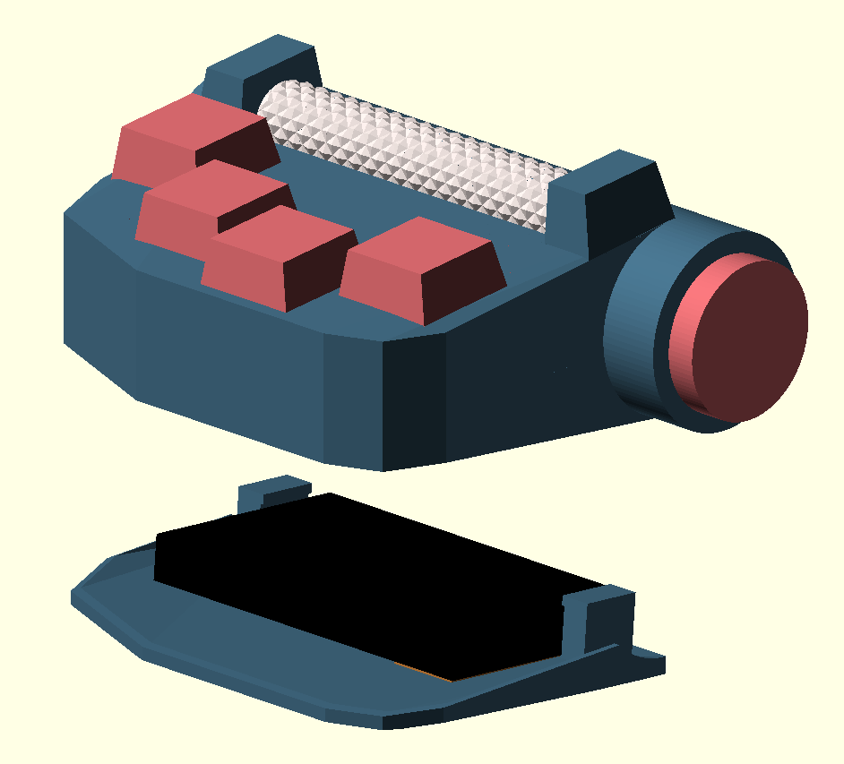

# Type-82
An ergonomic, split, wireless keyboard featuring 8 keys and 2 dpads

## Physical Layout
The render below demonstrates what the right hand side of the keyboard will look like. With a single row of keys seen in pink, finger extension as well as lateral movement is kept to a minimum. In theory this would reduce strain as well as the risk of RSI. The cylinder seen in pink in a 5 directional pad allowing for key combinations or "chording" to type all keys on a normal keyboard. Finally, seen in white is a knurled "scroll wheel" which can be used as vertical scroll, volume adjust, screen brightness adjust, etc.

## Keymap
Below is an initial keymap for the Type 82. Multiple colors can be seen demonstrating different "layers". Using [QMK](https://qmk.fm/) keyboard firmware, all standard keys can be typed by utilizing QMK's "layer" feature. On a normal keyboard, one can think of the Shift key representing a separate layer on a keyboard. Normally there is not a single key that one can press to type a capital `A`; instead, one must first hold the Shift key to access the capital letters "layer" and then press the `a` key to type a capital `A`. 

The Type 82 uses the concept of layers heavily. Each color represents two layers accessible by moving the directional pad in one of the cardinal directions. For example, the red layer on the left half of the image below is accessed by first holding the dpad on the left half of the keyboard in the left direction. As can be seen, while holding the dpad to the left, this makes the keys under the right fingers act as left click, middle click, right click, and printscreen. Further, the right hand dpad will move the mouse in the direction it is pressed. To reach the red layer on the right half of the image, the right hand dpad must be held in the left direction and combined with another key. In this manner all standard keys can be typed as seen in the example keymap.

While the letter layout might seem random at first, it's in fact a modification of the dvorak keyboard layout. While the standard QWERTY keyboard layout is standard, it is only so due to tradition. Popularized by typewriters as a way to minimize jamming of the arms which would imprint letters on paper, QWERTY has remained the standard far past the standardization of digital input. The dvorak layout, while failing to replace QWERTY as the standard, offers a more comfortable typing experience while placing more frequently used keys on the home row as well as promoting a "flow" of typing between the left and right hands. Vowels can be found on the left side while most commonly used consonants can be found on the right. Further information on the dvorak keyboard layout can be found [here](https://en.wikipedia.org/wiki/Dvorak_keyboard_layout).

## BOM
- 2 x [nRF52840 Express](https://www.adafruit.com/product/4481)	$35.90
- 2 x [LiPoly Backpack](https://www.adafruit.com/product/2124)	$9.90
- 2 x [2000mAh Lithium Battery](https://www.adafruit.com/product/2011)	$25.00
- 2 x [Qi Wireless Charging Receiver](https://www.adafruit.com/product/1901)	$29.90
- 1 x [Mini Rotary Shaft Encoder (lot of 5)](https://www.aliexpress.com/item/32988694062.html?spm=2114.search0302.3.150.2b9053288aErqe&ws_ab_test=searchweb0_0,searchweb201602_0,searchweb201603_0,ppcSwitch_0&algo_pvid=b8f704f6-06c1-4fb3-bbef-edd8e0cd6a59&algo_expid=b8f704f6-06c1-4fb3-bbef-edd8e0cd6a59-21)	$7.80 + tax & shipping
- 2 x [2 Axis Navigation Switch](https://www.digikey.com/product-detail/en/e-switch/JS5208/EG4561-ND/1739634)	$5.52
- 1 x [Zilent 78g Switches (lot of 10)](https://zealpc.net/collections/switches/products/zilents)	$12.00

## TODO
- [x] Build initial models
- [ ] Add rotary encoder cutout to keyboard model
- [ ] Finalize locking mechanism for keyboard scaffold
- [ ] Get dimensions for electronics
- [ ] Add internal mounts for electronics
